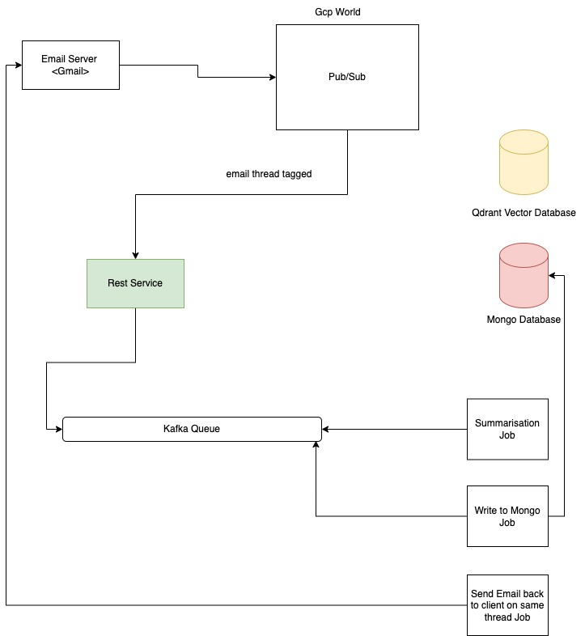

# Oncall Issue Resolution System

This system streamlines the process of resolving issues by leveraging oncall mailer aliases tied to specific appIds. It aims to enhance team efficiency and issue resolution speed by automating the process of identifying relevant past experiences and documentation.

## Premise

- **Oncall Alias Integration**: Every team pivoted on appId `<X>` has an oncall mailer tied to them.
- **Issue Resolution Flow**: When a new issue, Issue Y, arises, the oncall alias is added to an email thread. The oncall reads the thread, asks questions if necessary, and uses past experiences to solve the problem involving systems {A, B, C, ...}. They then reply back on the thread or add another team if needed.

## Optimizations

- **Thread Management**: Reading entire threads, which can be longer than 5-6 emails, is challenging. Can we improve this?
- **Past Experience Retrieval**: For a thread, can we extract past experiences that resemble the current issue?
- **Onboarding New Developers**: How can we onboard new developers to solve new issues using existing information?

## Functional Requirements

- **Email Thread Summary**: Ability to provide a tl;dr for an email thread X. [P0]
- **Similar Threads Retrieval**: Ability to find and sort the top K similar looking email threads in the past. [P0]
- **Documentation Search**: If no matching threads are found, the ability to search documentation for possible bugs. [P1]
- **Multi-tenancy and Authentication**: Users should have a dedicated namespace in the datastore and authentication should be implemented using JWT. [P1]

## Initial Scope + Tech Stack

- **Datastore**: Mongo for saving documents (email threads, confluence docs).
- **API Layer**: FastAPI for a stateless REST layer.
- **Data Format**: JSON for all request/response data.
- **LLM Model**: Gemma 7B or 3B deployed on a VM behind an ELB.
- **Embedding Model**: A top-of-the-line OSS embedding model for obtaining embedding vectors for chunks.
- **Vector Database**: Qdrant on top of MongoDB and the embedding model.

## HLD 

